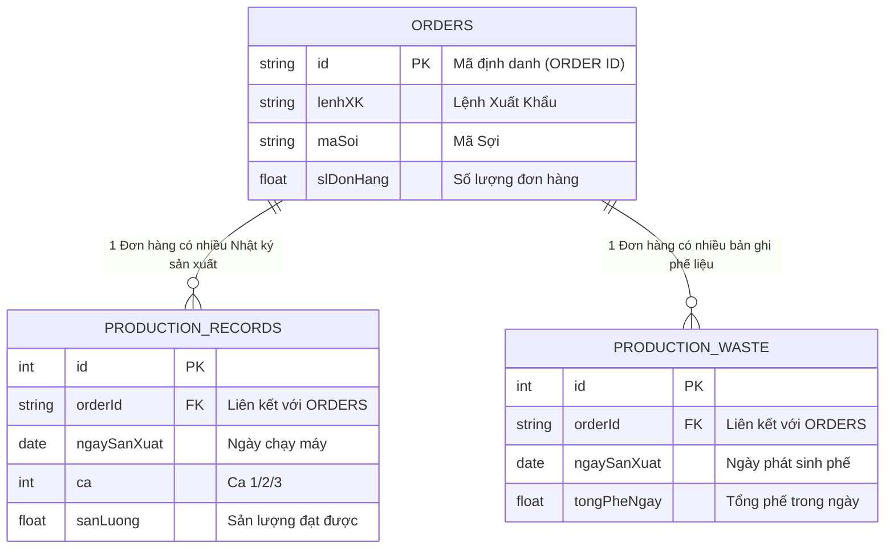

# SÁCH TRẮNG: HỆ THỐNG HÓA QUY TRÌNH SẢN XUẤT VÀ THIẾT KẾ DASHBOARD ĐO LƯỜNG HIỆU SUẤT

## CHƯƠNG 1: TƯ DUY HỆ THỐNG TRONG QUẢN LÝ SẢN XUẤT HIỆN ĐẠI

### 1.1. Phá vỡ "Ốc đảo Dữ liệu" (Data Silos)
Trong mô hình quản lý nhà máy truyền thống, dữ liệu thường bị cô lập trong các file Excel của từng bộ phận. File của phòng kế hoạch không khớp với file của xưởng sản xuất, và dữ liệu phế liệu lại nằm ở một bảng riêng. Đây gọi là hiện trạng **"Ốc đảo dữ liệu" (Data Silos)**.

Hậu quả của cách làm này là người quản lý luôn đi sau thực tế. Quyết định được đưa ra dựa trên dữ liệu của ngày hôm qua, thậm chí tuần trước. Khi phát hiện ra sự cố (ví dụ: phế liệu tăng cao), thì hàng tấn sản phẩm lỗi đã được bốc lên xe.

**Tư duy hệ thống (Systems Thinking)** nhìn nhận nhà máy không phải là các hoạt động rời rạc, mà là một **dòng chảy liên tục** của thông tin và vật chất. Một mắt xích thay đổi (ví dụ: Đơn hàng mới) sẽ tác động ngay lập tức đến kế hoạch sản xuất, máy móc vận hành và cả lượng phế liệu sinh ra.

Việc chuyển đổi từ các file Excel thủ công lên một Hệ thống Dashboard thời gian thực (Real-time) không đơn thuần là một nâng cấp về mặt phần mềm. Đó là sự chuyển dịch về mặt tư duy: Chuyển từ việc **"ghi nhận quá khứ"** sang **"quản trị hiện tại và làm chủ tương lai"**.

### 1.2. Giải mã Quy trình từ Dữ liệu Thô
Nhìn vào hai bảng Excel hiện tại là "Báo cáo tạo sợi" và "Bảng đơn hàng", một người bình thường chỉ thấy các hàng và cột số liệu khô khan. Nhưng dưới lăng kính tư duy hệ thống, chúng ta có thể bóc tách và tái dựng lại toàn bộ quy trình vận hành thực tế của nhà máy:

1. **Cấu trúc Đơn hàng phân tầng:** Một `LỆNH XK` (Lệnh xuất khẩu) đóng vai trò là chiếc ô lớn, chứa bên dưới nhiều `ORDER ID` (Từng mã sợi cụ thể). Đây là cấu trúc Một - Nhiều (One-to-Many) kinh điển trong các hệ thống ERP tiêu chuẩn.
2. **Nhịp đập sản xuất theo Ca:** Nhà máy vận hành liên tục. Dữ liệu sản lượng và thời gian chạy máy được bóc tách theo Ca 1, Ca 2, Ca 3. Điều này cho thấy nhu cầu quản trị năng suất chi tiết đến từng kíp trực và từng đầu máy.
3. **Nghịch lý Phế liệu:** Phế liệu được phân loại rất chi tiết (phế kéo máy, phế chạy máy, phế sự cố...) nhưng lại đang được lưu tổng theo ngày. Sự lệch pha này (Sản lượng theo ca - Phế liệu theo ngày) là một bài toán phân bổ dữ liệu cần giải quyết.

Từ những suy luận trên, chúng ta rút ra một kết luận quan trọng: Việc lập trình Dashboard không đơn thuần là bê nguyên si file Excel lên web. Nó là quá trình **chuyển đổi cấu trúc dữ liệu phẳng (Flat data) thành dữ liệu quan hệ (Relational data)** để phản ánh đúng thực tế dòng chảy sản xuất.

### 1.3. Đối chiếu với Triết lý ERP và MES Quốc tế
Để hoàn thiện tư duy hệ thống, chúng ta cần soi chiếu bài toán của mình vào các tiêu chuẩn công nghiệp toàn cầu. Những giải pháp quản trị sản xuất hàng đầu thế giới như SAP, Oracle hay Odoo thường chia bài toán này thành hai tầng rõ rệt:

1. **Tầng ERP (Enterprise Resource Planning):** Tập trung vào Hoạch định và Thương mại. Ở đây, Đơn hàng là trung tâm. ERP trả lời các câu hỏi: *Cần sản xuất bao nhiêu? Đã giao bao nhiêu? Tiến độ tổng thể thế nào?* (Tương ứng với dữ liệu trong "Bảng đơn hàng").
2. **Tầng MES (Manufacturing Execution System):** Tập trung vào Thực thi tại xưởng (Shop floor). MES đi sâu vào thời gian thực: *Máy nào đang chạy? Tốc độ bao nhiêu? Ai đang đứng máy? Phế liệu phát sinh ở đâu?* (Tương ứng với dữ liệu trong "Báo cáo tạo sợi").

Hệ thống Dashboard mà chúng ta đang xây dựng thực chất là một **giải pháp lai (Hybrid)** đóng vai trò cầu nối giữa ERP và MES. Chúng ta lấy dữ liệu kế hoạch (tính chất ERP) đối chiếu với dữ liệu thực thi theo từng ca máy (tính chất MES) để tính toán ra chỉ số OEE.

---

## CHƯƠNG 2: MÔ HÌNH HÓA CÁC THỰC THỂ LÕI

### 2.1. Thực thể Đơn hàng (Orders) - Gốc rễ của dòng chảy
Trong bất kỳ hệ thống quản trị sản xuất nào, Đơn hàng luôn là điểm khởi đầu và là gốc rễ của mọi hoạt động. Nó trả lời cho câu hỏi cốt lõi của doanh nghiệp: *Chúng ta cần sản xuất cái gì, số lượng bao nhiêu, và tiêu chuẩn thế nào?*

Dựa trên dữ liệu từ file Excel, thực thể Đơn hàng được định nghĩa bởi các thuộc tính then chốt sau:
*   **Mã định danh:** `LỆNH XK` (Mã đơn hàng lớn) và `ORDER ID` (Mã định danh cho từng loại sợi trong đơn).
*   **Thông tin sản phẩm:** `Mã sợi`, `Tên sợi` (Định nghĩa loại hàng cần sản xuất).
*   **Chỉ tiêu số lượng:** `SL Đơn hàng` (Sản lượng đích cần phải đạt được).

Vai trò tối thượng của thực thể Đơn hàng trong hệ thống Dashboard là làm **Mốc tham chiếu (Baseline)**. Mọi con số sản lượng làm ra hàng ngày đều phải quy chiếu về đây để trả lời câu hỏi: *Chúng ta đã hoàn thành bao nhiêu % đơn hàng và cần sản xuất tiếp bao nhiêu nữa?*

### 2.2. Thực thể Nhật ký Sản xuất (Production Records) - Nhịp đập thời gian
Nếu Đơn hàng là bản kế hoạch mang tính tĩnh, thì Nhật ký Sản xuất chính là thực tế mang tính động. Đây là thực thể ghi lại "hơi thở" hàng ngày của xưởng, phản ánh những gì thực sự diễn ra tại các đầu máy.

Dữ liệu trong "Báo cáo tạo sợi" định hình nên các thuộc tính cốt lõi của thực thể này:
*   **Thời gian:** `Ngày sản xuất` và `Ca` (Ca 1, Ca 2, Ca 3).
*   **Vị trí:** `Máy TS` (Tên máy đang vận hành).
*   **Kết quả:** `Sản lượng` (số kg sợi làm ra) và `Thời gian TS` (số phút máy chạy).

Đây là loại **Dữ liệu giao dịch (Transactional Data)** - phát sinh liên tục theo thời gian. Mỗi ngày, mỗi ca, mỗi máy sẽ sinh ra các dòng dữ liệu mới. 

### 2.3. Thực thể Phế liệu (Waste) - Mặt tối của năng suất
Trong ngành sản xuất, phế liệu là yếu tố không thể tránh khỏi. File Excel phân loại phế liệu cực kỳ chi tiết: *phế kéo máy, phế chạy máy, phế chuyển đổi, phế sự cố...* Chứng tỏ quy trình sản xuất có nhiều công đoạn và phế liệu phát sinh ở các kịch bản khác nhau.

Tuy nhiên, thách thức lớn nhất là: **Sự lệch pha về độ mịn dữ liệu (Granularity Mismatch)**.
*   Sản lượng được ghi nhận chi tiết theo **Ca** (12 tiếng).
*   Phế liệu lại được ghi chép tổng hợp theo **Ngày** (24 tiếng).

Để giải quyết bài toán này trên Dashboard, hệ thống bắt buộc phải áp dụng thuật toán **Phân bổ tỷ lệ thuận** (chia nhỏ phế ngày cho các ca dựa trên tỷ lệ sản lượng họ làm ra). Thực thể Phế liệu đóng vai trò quyết định để tính toán ra chỉ số **Chất lượng (Quality)** trong OEE.

### 2.4. Sơ đồ Quan hệ Thực thể (ERD)
Để chuyển hóa các khái niệm trên thành cơ sở dữ liệu vật lý, chúng ta hệ thống hóa chúng thành một Sơ đồ ERD đơn giản:

---

## CHƯƠNG 3: HỆ THỐNG ĐO LƯỜNG HIỆU SUẤT (OEE)

### 3.1. Triết lý OEE trong sản xuất hiện đại
OEE (Overall Equipment Effectiveness) là tiêu chuẩn vàng toàn cầu để đo lường năng suất. Nó bóc tách năng suất dưới 3 khía cạnh:
1. **Mức độ Khả dụng (Availability - A):** Đo lường tổn thất về thời gian.
2. **Hiệu suất (Performance - P):** Đo lường tổn thất về tốc độ.
3. **Chất lượng (Quality - Q):** Đo lường tổn thất về chất lượng.

Công thức: **OEE = A x P x Q**.

### 3.2. Availability (Mức độ Khả dụng) - Bài toán thiếu dữ liệu thời gian
Công thức: `Thời gian chạy máy thực tế / Thời gian sản xuất theo kế hoạch`.

Thời gian kế hoạch cố định là **12 giờ (720 phút)** cho mỗi ca. Tuy nhiên, do cột `Thời Gian TS` hầu hết bị để trống, hệ thống áp dụng một **Giả định thực nghiệm (Heuristic)**: Đối với những dòng bị trống dữ liệu thời gian, hệ thống tự động hiểu là máy đã chạy đủ 12 giờ (Khả dụng = 100%). 

### 3.3. Performance (Hiệu suất) - Thuật toán đi tìm "Định mức" từ lịch sử
Công thức: `Sản lượng thực tế / Sản lượng định mức (lý thuyết)`.

Do thiếu cột định mức, hệ thống áp dụng tư duy **Khai phá Dữ liệu (Data-driven)**: Tự động quét lịch sử và lấy ra con số **Sản lượng lớn nhất** từng đạt được trong một ca (dưới 50,000 kg để loại bỏ dòng tổng cộng) làm mốc 100%.

### 3.4. Quality (Chất lượng) - Nghệ thuật phân bổ phế liệu
Công thức: `Sản lượng đạt chuẩn / Tổng sản lượng đầu vào`.

Áp dụng thuật toán **Phân bổ tỷ lệ thuận**: 
`Phế liệu phân bổ cho Ca X = Tổng phế trong ngày x (Sản lượng Ca X / Tổng sản lượng trong ngày)`.

### 3.5. Tổng hợp OEE và Ý nghĩa thực tiễn
OEE cung cấp một **Thước đo duy nhất (Single Metric)** để đánh giá "sức khỏe" của một ca sản xuất. Nó biến những dữ liệu tĩnh trong file Excel thành những **Hành động quản trị cụ thể** (biết chính xác ca nào yếu khâu nào để cải tiến).

---

## CHƯƠNG 4: KIẾN TRÚC HỆ THỐNG CHỊU TẢI VÀ XỬ LÝ DỮ LIỆU LỚN

### 4.1. Điểm nghẽn hiệu năng khi dữ liệu phình to
Khi số lượng dòng dữ liệu vượt qua con số hàng chục nghìn, file Excel sẽ bị ì ách. Tương tự, nếu đẩy toàn bộ dữ liệu thô lên trình duyệt rồi dùng Javascript để tự nhóm, trình duyệt sẽ ngốn sạch RAM và gây giật lag. Giải pháp là dồn gánh nặng tính toán về cho phía Server (Backend).

### 4.2. Chiến lược Phân chia tải (Compute Offloading)
Áp dụng nguyên lý: Việc gì nặng hãy để Server làm, trình duyệt chỉ hiển thị.
Backend sẽ thực hiện câu lệnh `GROUP BY` theo `LỆNH XK` ngay trong database để tính ra các con số tổng, sau đó mới gửi mảng dữ liệu đã thu gọn lên Frontend. Điều này giúp giảm tải cho trình duyệt tới 90%.

### 4.3. Tối ưu hóa Cơ sở dữ liệu (Indexing & Query Optimization)
Cần đánh chỉ mục (Index) cho các cột: `ngay_san_xuat` (để lọc thời gian) và `order_id` (để JOIN bảng). Đối với các báo cáo nặng như OEE, đề xuất sử dụng **Materialized View** để tính toán sẵn dữ liệu.

### 4.4. Quản lý Trạng thái (State Management) ở Frontend
Phân chia thành 2 loại:
*   **Server State (Dùng React Query):** Lưu bộ nhớ đệm dữ liệu từ API để hiển thị tức thì.
*   **UI State (Dùng useState):** Quản lý trạng thái đóng/mở (Expand/Collapse) của các hàng trong bảng.

### 4.5. Hướng tới kiến trúc Real-time
Để tiến tới sự hoàn thiện, cần loại bỏ file Excel. Sử dụng công nghệ **WebSocket** hoặc **SSE** để Server chủ động "đẩy" dữ liệu mới từ máy sản xuất xuống trình duyệt ngay lập tức.

---

## CHƯƠNG 5: NGHIÊN CỨU CASE STUDY & KẾT LUẬN

### 5.1. Hành trình Chuyển đổi số (Từ Excel sang Dashboard)
Hành trình đi qua 4 bước: (1) Kiểm toán dữ liệu thô -> (2) Mô hình hóa thực thể -> (3) Xử lý logic thuật toán OEE -> (4) Trực quan hóa giao diện Web.

### 5.2. Bài học kinh nghiệm về Quản lý Dữ liệu
Dự án để lại 3 bài học đắt giá về chất lượng dữ liệu đầu vào: Bài học về dữ liệu trống, dữ liệu lệch pha và dữ liệu bẩn. Phần gốc rễ của chuyển đổi số nằm ở việc chuẩn hóa quy trình ghi chép dữ liệu tại xưởng.

### 5.3. Kết luận và Lộ trình Tương lai
Dự án đã đặt nền móng vững chắc. Lộ trình tiếp theo gồm 3 giai đoạn:
*   **Giai đoạn 1:** Chuẩn hóa quy trình nhập liệu tại xưởng (ghi nhận thời gian và phế theo ca).
*   **Giai đoạn 2:** Số hóa và cập nhật Real-time (loại bỏ file Excel).
*   **Giai đoạn 3:** Xây dựng hệ thống MES toàn diện.
