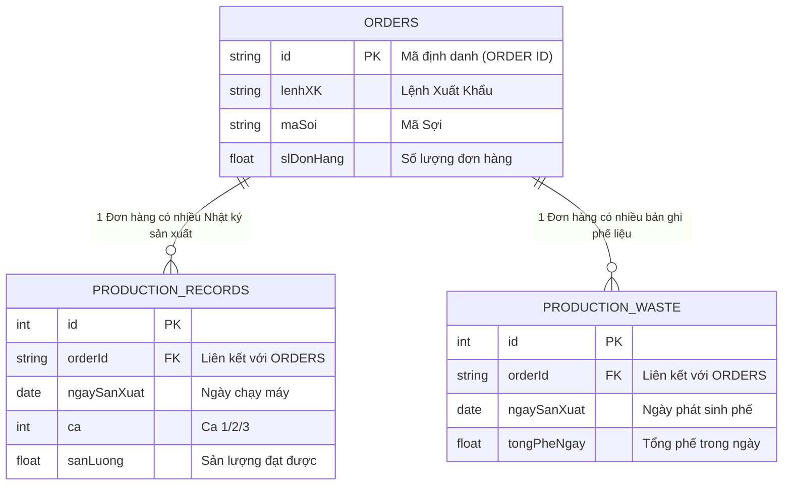

# CHƯƠNG 2: MÔ HÌNH HÓA CÁC THỰC THỂ LÕI

### 2.1. Thực thể Đơn hàng (Orders) - Gốc rễ của dòng chảy
Trong bất kỳ hệ thống quản trị sản xuất nào, Đơn hàng luôn là điểm khởi đầu và là gốc rễ của mọi hoạt động. Nó trả lời cho câu hỏi cốt lõi của doanh nghiệp: *Chúng ta cần sản xuất cái gì, số lượng bao nhiêu, và tiêu chuẩn thế nào?*

Dựa trên dữ liệu từ file Excel, thực thể Đơn hàng được định nghĩa bởi các thuộc tính then chốt sau:
*   **Mã định danh:** `LỆNH XK` (Mã đơn hàng lớn) và `ORDER ID` (Mã định danh cho từng loại sợi trong đơn).
*   **Thông tin sản phẩm:** `Mã sợi`, `Tên sợi` (Định nghĩa loại hàng cần sản xuất).
*   **Chỉ tiêu số lượng:** `SL Đơn hàng` (Sản lượng đích cần phải đạt được).

Vai trò tối thượng của thực thể Đơn hàng trong hệ thống Dashboard là làm **Mốc tham chiếu (Baseline)**. Mọi con số sản lượng làm ra hàng ngày đều phải quy chiếu về đây để trả lời câu hỏi: *Chúng ta đã hoàn thành bao nhiêu % đơn hàng và cần sản xuất tiếp bao nhiêu nữa?*

### 2.2. Thực thể Nhật ký Sản xuất (Production Records) - Nhịp đập thời gian
Nếu Đơn hàng là bản kế hoạch mang tính tĩnh, thì Nhật ký Sản xuất chính là thực tế mang tính động. Đây là thực thể ghi lại "hơi thở" hàng ngày của xưởng, phản ánh những gì thực sự diễn ra tại các đầu máy.

Dữ liệu trong "Báo cáo tạo sợi" định hình nên các thuộc tính cốt lõi của thực thể này:
*   **Thời gian:** `Ngày sản xuất` và `Ca` (Ca 1, Ca 2, Ca 3).
*   **Vị trí:** `Máy TS` (Tên máy đang vận hành).
*   **Kết quả:** `Sản lượng` (số kg sợi làm ra) và `Thời gian TS` (số phút máy chạy).

Đây là loại **Dữ liệu giao dịch (Transactional Data)** - phát sinh liên tục theo thời gian. Mỗi ngày, mỗi ca, mỗi máy sẽ sinh ra các dòng dữ liệu mới. 

### 2.3. Thực thể Phế liệu (Waste) - Mặt tối của năng suất
Trong ngành sản xuất, phế liệu là yếu tố không thể tránh khỏi. File Excel phân loại phế liệu cực kỳ chi tiết: *phế kéo máy, phế chạy máy, phế chuyển đổi, phế sự cố...* Chứng tỏ quy trình sản xuất có nhiều công đoạn và phế liệu phát sinh ở các kịch bản khác nhau.

Tuy nhiên, thách thức lớn nhất là: **Sự lệch pha về độ mịn dữ liệu (Granularity Mismatch)**.
*   Sản lượng được ghi nhận chi tiết theo **Ca** (12 tiếng).
*   Phế liệu lại được ghi chép tổng hợp theo **Ngày** (24 tiếng).

Để giải quyết bài toán này trên Dashboard, hệ thống bắt buộc phải áp dụng thuật toán **Phân bổ tỷ lệ thuận** (chia nhỏ phế ngày cho các ca dựa trên tỷ lệ sản lượng họ làm ra). Thực thể Phế liệu đóng vai trò quyết định để tính toán ra chỉ số **Chất lượng (Quality)** trong OEE.

### 2.4. Sơ đồ Quan hệ Thực thể (ERD)
Để chuyển hóa các khái niệm trên thành cơ sở dữ liệu vật lý, chúng ta hệ thống hóa chúng thành một Sơ đồ ERD đơn giản:

---
[⬅️ Quay lại trang chủ](../INDEX.md)
